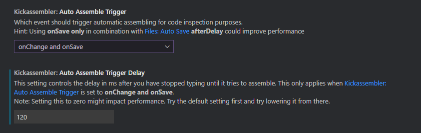
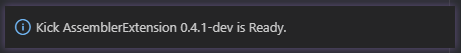
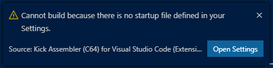
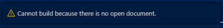
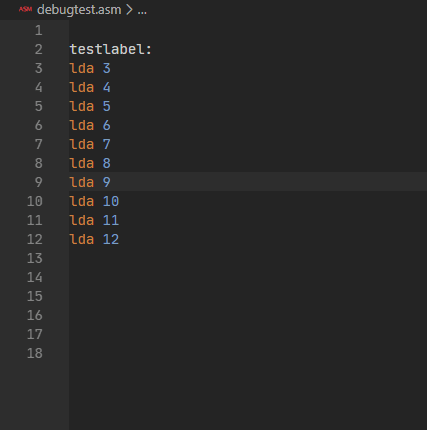

# Release Notes

## v0.4.1

And a big thank you to everyone using the extension. Your feedback, ideas and bug reports are making this tool better every day.

This is mostly a bug fix release with a sprinkling of new feature goodness thrown in for good measure.

First up, there were still a good amount of bugs showing up with the new Startup setting. We have made a few tweaks to how this works and this version should be better, although no promises.

Next, some folks were experiencing a lot of errors when using the **onChange** trigger setting for real time feedback to the editor. A new setting has been added to help control the amount of time before the editor tries to assemble your file. The new setting is called `Auto Assembler Trigger Delay` will now wait for the time specified in milliseconds after you have finished typing before assembling the file. The old method would try to assemble the file every single time you changed something which impacted performance and caused other issues as well. This setting should help make your experience a LOT better, especially on the Mac.

A new message has been added when you open a new project using this extension that it has been activated. It will also tell you what version you are currently running.

Anytime you try to build the current file or the startup, and those are not available, a message will warn you.

When you try to build using a startup file, and you have not set that, you will receive a message and be given the option to go change that setting.

When you try to build using the current open file, and you actually do not have one open, you will receive this message.

Marco (aka Lubber) was hard at work adding the ability to add breakpoints to your code using the built-in features of Code. This is a really nifty feature requested by a user of the tool.

`.break` will be created when a normal Breakpoint is created

`.break "condition > 1337"` will be created when a vscode "Conditional Breakpoint" is created.
No need for entering the double quotes, they will be inserted automatically

`.print "whatever"` will be created when a *LogPoint" is created
Here you have to enter the double quotes in the logmessage manually. This is because the print directive supports references to symbols of the source (like .print "whatever"+lineNumber

Keep those ideas coming!

We hope you enjoy the new changes, and that you are finding the extension to be useful.

For a full list of changes, please see the projects [History](HISTORY.md) file.

Much more to come, check the roadmap, and let us know if there is something else you would like to be added by sending us a note on Facebook or creating an [Issue](https://gitlab.com/retro-coder/commodore/kick-assembler-vscode-ext/issues) on the project page.

Cheers!
