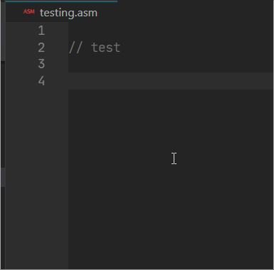

# Release Notes

## v0.4.2

And a big thank you to everyone using the extension. Your feedback, ideas and bug reports are making this tool better every day.

This is a small bug fix release to supress a number of errors occuring when a new file was created.

There are a few more checks in place now to see if a startup file is there to supress some of the errors that were occuring. Hopefully you won't see any of them anymore.

Marco (aka Lubber) made a small tweak to the break/print changes, and made it even better by letting you add them manually now.

For a full list of changes, please see the projects [History](HISTORY.md) file.

Much more to come, check the roadmap, and let us know if there is something else you would like to be added by sending us a note on Facebook or creating an [Issue](https://gitlab.com/retro-coder/commodore/kick-assembler-vscode-ext/issues) on the project page.

Cheers!
